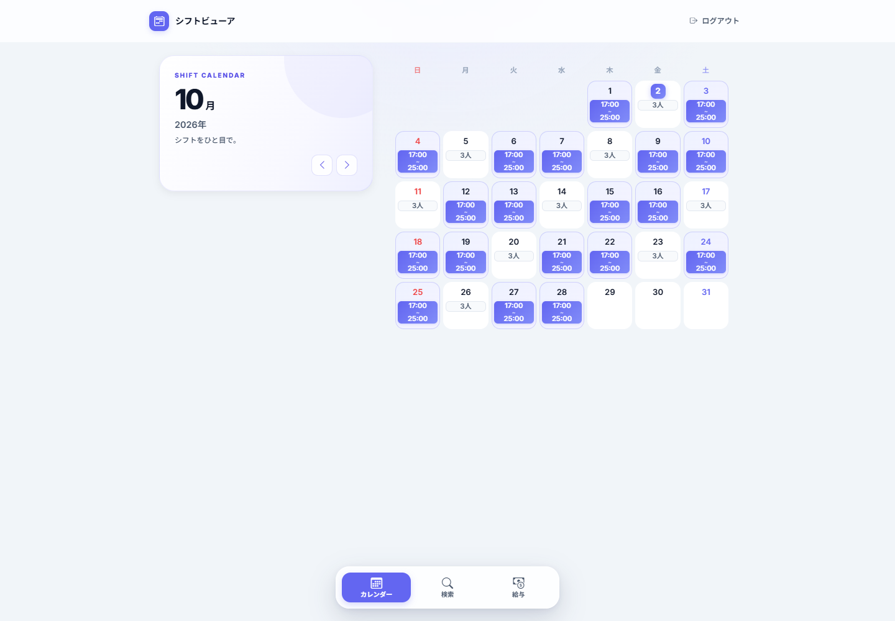
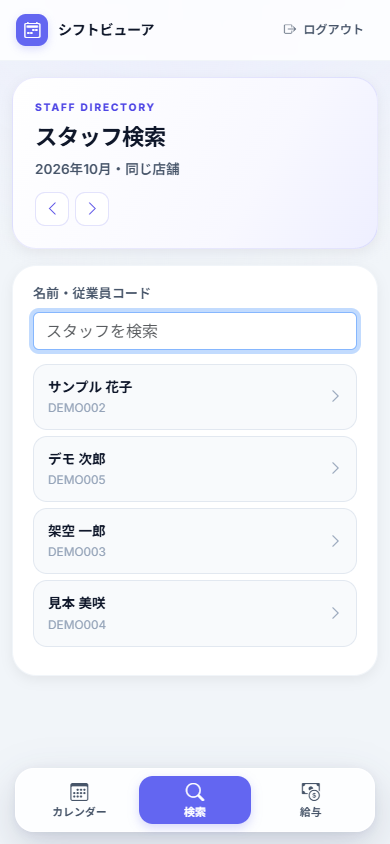
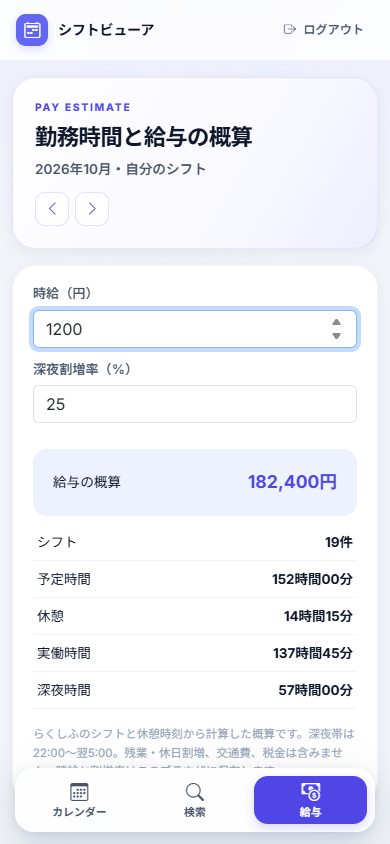

# rakushifu-viewer

**らくしふのシフト・メンバー情報を見やすく表示し、予定シフトから給与の概算を計算する非公式のWebアプリです。** PCとスマートフォンのブラウザから、月の予定、一緒に働くメンバー、自分の勤務時間を確認できます。

らくしふの公式提供・公認ツールではありません。すかいらーくグループ向けのらくしふを利用する従業員本人を対象としています。現在の接続先は企業コード`skylark`に固定されており、他社のアカウントを選択する機能はありません。管理者機能、シフトの登録・変更、らくしふへの給与設定の書き込みは実装していません。

## 目次

- [主な機能](#主な機能)
- [画面例](#画面例)
- [クイックスタート](#クイックスタート)
- [Cloudflare Workersで実行する](#cloudflare-workersで実行する)
- [実行環境による違い](#実行環境による違い)
- [技術構成](#技術構成)
- [認証とデータの扱い](#認証とデータの扱い)
- [テスト](#テスト)
- [ドキュメント](#ドキュメント)
- [不具合報告・開発参加](#不具合報告開発参加)
- [ライセンス](#ライセンス)

## 主な機能

| 機能 | 内容 |
| --- | --- |
| 月間カレンダー | 自分の出退勤時刻と、自分が勤務しない日の出勤人数を表示。前月・翌月へ切り替え |
| 日別一覧 | その日のメンバー、勤務時刻、休憩を表示。自分と勤務時間が重なる人、退勤時刻が同じ人を識別 |
| メンバー検索 | 表示月のデータから、名前・従業員コードで部分一致検索 |
| メンバー詳細 | 名前、従業員コード、誕生日・年齢と月間シフト、休憩控除後の勤務時間を表示 |
| 給与概算 | 自分の予定シフトを使い、時給・深夜割増率から月の給与を計算 |

検索対象には、自店舗に所属する人と、表示月に自店舗で勤務する人が含まれます。検索結果から自分自身は除きます。取得データにないメンバー情報は表示できません。

給与は予定ベースの概算です。実際の勤怠、残業・休日割増、交通費、税金などは反映しません。計算式と対象範囲は[利用ガイド](docs/usage.md#給与の計算方法)に記載しています。

## 画面例

以下の画面は、**架空の従業員・架空のシフトを使ったデモデータ**で撮影しています。実際の従業員情報や勤務予定は含みません。



| メンバー検索 | 給与概算 |
| --- | --- |
|  |  |

## クイックスタート

ローカル版にはPython 3.10以上と、対象のらくしふアカウントが必要です。ソースを取得・展開し、プロジェクトのルートで実行してください。

Windows / PowerShell:

```powershell
python -m venv .venv
.\.venv\Scripts\python.exe -m pip install -r requirements-local.txt
$env:APP_ENV = "test"
.\.venv\Scripts\python.exe api.py
```

macOS / Linux:

```sh
python3 -m venv .venv
.venv/bin/python -m pip install -r requirements-local.txt
APP_ENV=test .venv/bin/python api.py
```

[http://127.0.0.1:5000](http://127.0.0.1:5000)を開き、らくしふの従業員IDとパスワードでログインします。終了するときはターミナルで`Ctrl+C`を押します。

`test`はローカル向けの保存方式を示す名前です。**このモードでも実際のらくしふにログインし、実データを取得します。** ダミーデータに切り替わる設定ではありません。

ローカル版は`requirements-local.txt`から依存を導入します。ルートの`pyproject.toml`はPython 3.14を使うWorkers向けです。詳しい準備手順とトラブル対応は[起動・デプロイガイド](docs/setup.md)を参照してください。

## Cloudflare Workersで実行する

Workers版にはPython 3.14、uv、Node.js 22以上とnpmが必要です。クラウドに公開する場合はCloudflareアカウントも用意します。

Workers版はローカル起動に加え、GitHub ActionsからCloudflareへのデプロイ、公開先のログイン画面・静的ファイルの配信、未認証APIの応答を確認しています。Workers版の実アカウントでのログイン・シフト取得は未確認です。実接続まで確認済みなのはFlask版です。

```sh
npm ci
python scripts/prepare_worker.py
cd .worker-build
uv run pywrangler dev
```

起動後、ターミナルに表示されたURLを開きます。クラウドへデプロイする場合は、同じ`.worker-build`内で次を実行します。

```sh
npx wrangler login
uv run pywrangler deploy
```

`worker.py`が`production`モードを指定します。`APP_ENV`を手動で切り替える必要はありません。`prepare_worker.py`は`.worker-build`全体を再作成するため、その中のローカルセッションも消えます。コード変更後の再ビルド、バインディング、公開後の確認手順は[Workersの起動・デプロイ](docs/setup.md#workersの起動デプロイ)に記載しています。

GitHub Actionsでは、既存のローカルテストを実行し、成功した`main`の変更をCloudflareへ自動デプロイします。Pull Requestではテストだけを実行します。初回はGitHub SecretsにCloudflareの認証情報を登録してください。[自動デプロイの設定](docs/setup.md#github-actionsから自動デプロイする)に手順を記載しています。

## 実行環境による違い

画面、API、勤務時間と給与の計算ロジックは共通です。らくしふとの通信、認証情報の保存、静的ファイルの配信を環境ごとに切り替えます。

Durable Objectsは、セッションなどの状態と保存領域をObject単位で管理するCloudflareの仕組みです。

| 項目 | ローカルのFlask版 | Workers版（ローカル開発を含む） |
| --- | --- | --- |
| 入口 | `api.py` | `worker.py` |
| 実行モード | `test` | `production` |
| Python | 3.10以上 | 開発用Python 3.14、実行時はPython Workers |
| 外部通信 | `requests.Session` | Workersの`fetch` |
| らくしふの認証Cookie | サーバープロセスのメモリ | セッションごとのDurable Objectストレージ |
| 月別シフト | セッションごとのメモリ | Durable Objectのメモリ |
| ログイン試行制限 | プロセスのメモリ | 別のDurable Objects |
| 静的ファイル | Flaskから配信 | `ASSETS`バインディングから配信 |
| プロセス・Objectの再起動 | ログインし直す | 保存済みセッションを復元し、シフトは再取得 |
| アプリCookieの`Secure` | 既定は無効 | 必須 |

両環境ともログインの有効期限は1時間、シフトのキャッシュは120秒、上限は1セッションにつき3か月分です。有効期限はログイン時から数え、操作しても延長しません。詳細な処理の流れは[技術仕様](docs/architecture.md)を参照してください。

## 技術構成

バックエンドはPython / Flask、フロントエンドはHTML・CSS・JavaScriptです。画面の部品にはBootstrapを使います。Node.jsはWorkersの開発・デプロイ用で、Flask版の起動には不要です。

```text
app/
  domain/          時刻・シフト・メンバーのモデル、勤務時間と給与計算
  application/     ログイン、シフト参照、検索、キャッシュ制御
  infrastructure/  らくしふ通信、外部JSON変換、環境別セッション
  web/             Flaskの画面・APIルート
templates/         ログイン画面とアプリ画面
static/            CSSとJavaScript
scripts/           Workers用のビルド準備
tests/             人工データを使った単体・結合テスト
api.py             ローカルの入口
worker.py          WorkersとDurable Objectsの入口
wrangler.toml      Workersの配信・バインディング設定
```

各層の責務、データモデル、APIの入出力は[技術仕様](docs/architecture.md)にまとめています。

## 認証とデータの扱い

ログイン時、アプリのサーバーが従業員IDとパスワードを受け取り、らくしふの認証APIへ送信します。パスワードを保存する処理はありません。認証後は、らくしふの利用者情報から本人・所属店舗・所属業態を特定し、その店舗のシフトを取得します。

ブラウザには、らくしふのCookieとは別の`app_session` Cookieを渡します。このCookieは`HttpOnly`・`SameSite=Lax`で、Workers版では`Secure`も付けます。ログアウト時にはアプリのセッションを削除します。

Workers版では、認証CookieとCSRFトークンに加え、利用者を識別する情報と有効期限をDurable Objectに保存します。月別シフトの永続保存は行いません。給与計算の入力値はブラウザの`localStorage`に利用者IDごとに保存され、ログアウト後も残ります。保存場所と削除タイミングの詳細は[認証とデータの保持](docs/architecture.md#認証とデータの保持)を参照してください。

## テスト

ローカル用の依存を導入した環境で実行します。

```sh
python -m unittest discover -s tests
```

人工データと通信・ストレージの代替実装を使うため、実際のらくしふアカウントは不要です。認証Cookieの分離、店舗・業態の扱い、検索、期限切れ、給与計算、Durable Objectsの保存処理などを確認します。実アカウントでの接続やCloudflareへのデプロイは、このテストには含まれません。

## ドキュメント

| 文書 | 内容 |
| --- | --- |
| [起動・デプロイガイド](docs/setup.md) | 必要なツール、Flask版・Workers版の起動、デプロイ、設定、トラブル対応 |
| [利用ガイド](docs/usage.md) | カレンダー、日別一覧、メンバー検索、給与計算の使い方と計算条件 |
| [技術仕様](docs/architecture.md) | 構成、通信、キャッシュ、認証情報の保持、APIリファレンス |

## 不具合報告・開発参加

不具合報告と機能要望は、このリポジトリのGitHub Issuesで受け付けます。変更の提案はPull Requestsで受け付けます。

不具合報告には、次の情報を記載してください。

- 実行環境：Flask / Workersローカル / Cloudflare。
- 再現手順。
- 期待する動作と、実際に起きたこと。

パスワード、Cookie、従業員ID、実在するスタッフの情報を公開の本文や画像に含めないでください。

コードを変更した場合は、上記のテストを実行し、画面や動作への影響をPull Requestに記載してください。

## ライセンス

配布ライセンスは未決定です。現時点で、本プロジェクトのライセンスファイルは設置していません。
